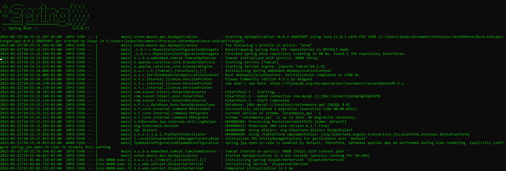
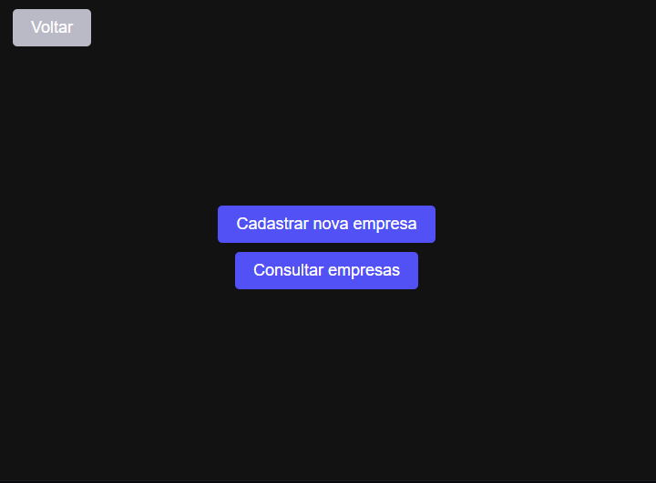
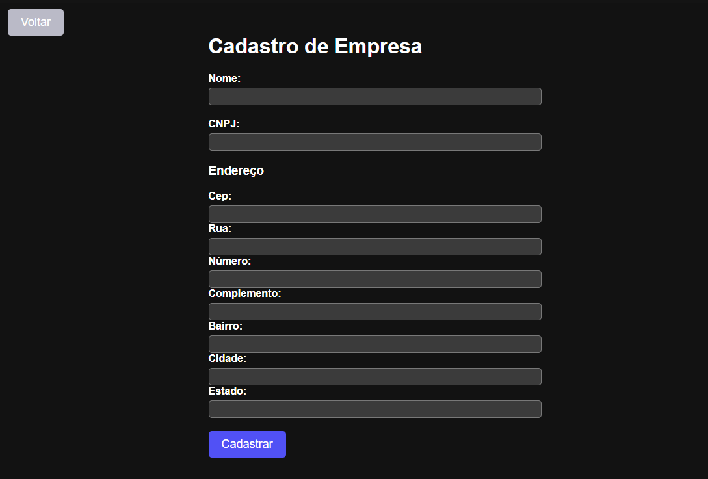

# OstenMoove_Sistema de gerenciamento de empresas. 
Api - Gerenciamento de empresas: cadastros, alterações, exibição e exclusão das empresas cadastradas.
Contem: Api com as funções principais e Front com paginas de cadastro e listagem de empresas cadastradas, assim como alteração e exclução de empresas. 

## Programas necessarios para execução.

- Java 17.
- MySQL

## Como criar a data base.

1. Instale MySQL. (Para mais detalhes, acesse o link: https://www.alura.com.br/artigos/mysql-do-download-e-instalacao-ate-sua-primeira-tabela)
2. Acesse o Prompt de Comando.
3. Faça o login no seu MySQL com o comando: mysql -u root -p. 
4. Digite sua senha. (Criada na instalar do MySQL)
5. Digite o comando: CREATE DATABASE NOME-DO-SEU-BANCO;
6. Digite o comando: USE NOME-DO-SEU-BANCO;

## Instalação do projeto.

1. Clone o repositório: `git clone  https://github.com/LeoPatricio/OstenMoove_api`
2. Entre no diretório do projeto: `cd ../OstenMoove_api`
3. Execute o segundo comando para rodar a API: `java "-Dspring.profiles.active=prod" "-DDATASOURCE_URL=jdbc:mysql://localhost/ostenmoove_api" "-DDATASOURCE_USERNAME=SEULOGIN" "-DDATASOURCE_PASSWORD=SUASENHA" -jar api-0.0.1-SNAPSHOT.jar` 
Obs: Altere a variavel "DDATASOURCE_URL" para o endereço do seu banco de dados e as variaveis: DDATASOURCE_USERNAME e DDATASOURCE_PASSWORD para seu login e senha dos MySQL respectivamente.
4. Apos executar esse comando, deve aparecer: 

## Como usar.
1. Execute o projeto: `index.html`
2. Teste as funcionalidades disponiveis. 

Aqui estão alguns exemplos do sistema. 

